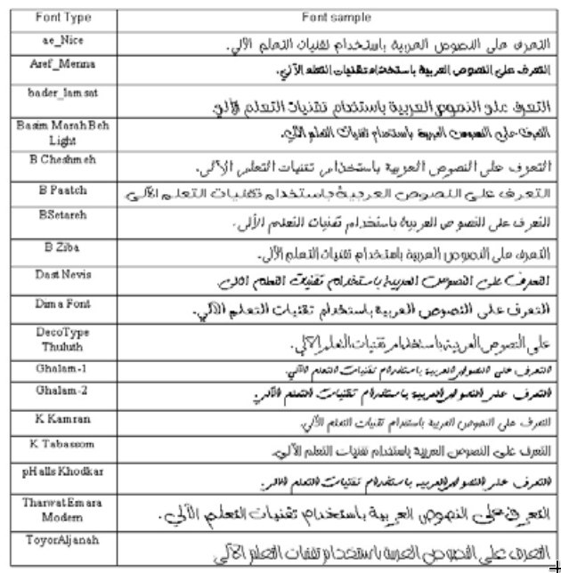

# Arabic Optical Character Recognition (OCR)

This model can be used to train Deep Learning OCR models to recognize words in any language including Arabic. 
The model operates in an end to end manner with high accuracy words without the need to segment words.
The model can be trained to recognized words in different fonts. It was tested on (18) font types and the accuracy was high.

The details of this model are presented at:
https://arxiv.org/abs/2009.01987

The code to generate the dataset (Arabic word images and labels) can be found at:
https://github.com/msfasha/TextIimagesToolkit
Using that toolkit, Arabic words can be generated using different fonts, word length and word number in a line.

Samples of the datasets that were used to train and test the model can be found at: 

https://drive.google.com/drive/folders/1mRefmN4Yzy60Uh7z3B6cllyyOXaxQrgg?usp=sharing

The code in this model was based on the work of https://github.com/githubharald/SimpleHTR.

## Usage, Run on Local Environment:

- Clone/fork the repository into you local system (git clone git@github.com:msfasha/Arabic-Deep-Learning-OCR.git)
- Create python virtual environment in the repository directory.

  sudo apt-get install python3-venv
  python3 -m venv env

- Activate python virtual environment.

  source ./env/activate

- install the required python libraries (this script uses TensorFlow version 1.x).

  pip install -r requirements.txt

- Download sample dataset from:
  https://drive.google.com/drive/folders/1mRefmN4Yzy60Uh7z3B6cllyyOXaxQrgg?usp=sharing

  A suitable dataset for initial training is the (1_nice_60000_rows) dataset.

  Download the two files of that dataset are:
  
    1_nice_60000_rows.bin
    https://drive.google.com/file/d/1K2EzzIwI5A0rJ0X0yQGj4p_bpo1hs0Sm/view?usp=sharing
    
    and 
    
    1_nice_60000_rows.txt
    https://drive.google.com/file/d/1uLf5ijOcupi-JuYZWYj7s6Jb-d2u2i4B/view?usp=sharing

- Save dataset files in the dataset folder of the project (the location of the data files can be changed in Config.py).

- Configurations of the run session can be adjusted in the Config.py, this includes folders names, the dataset files, the session type e.g. Train, Test, Infer and many other settings.

- Initial setting of the configuration is:

- BASE_FILENAME = "1_nice_60000_rows"
- OPERATION_TYPE = OperationType.Training
- REGENERATE_CHARLIST_AND_CORPUS = True
- TRAINING_SAMPLES_PER_EPOCH = 5000
- BATCH_SIZE = 100
- IMAGE_WIDTH = 128
- IMAGE_HEIGHT = 32
- MAX_TEXT_LENGTH = 32

- In the terminal window, goto src folder and run python Main.py.
- The code will generate training, validation and testing dataset from (1_nice_60000_rows) dataset, and the training session will start.

Different datasets can be generated using https://github.com/msfasha/TextIimagesToolkit

## References
* [A Hybrid Deep Learning Model For Arabic Text Recognition](https://arxiv.org/abs/2009.01987)
* [Build a Handwritten Text Recognition System using TensorFlow](https://towardsdatascience.com/2326a3487cd5)
